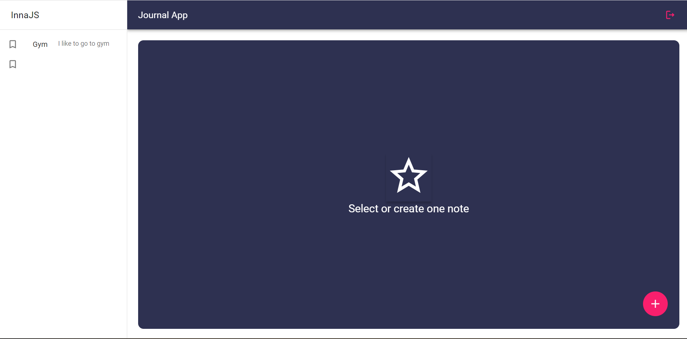
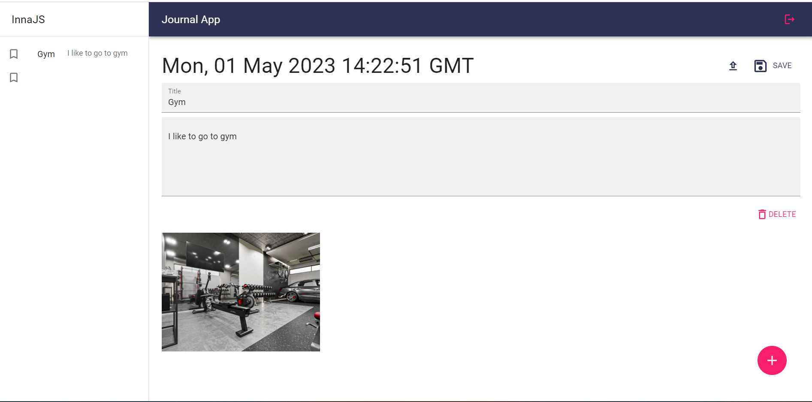
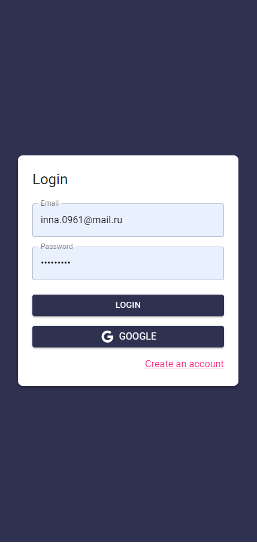
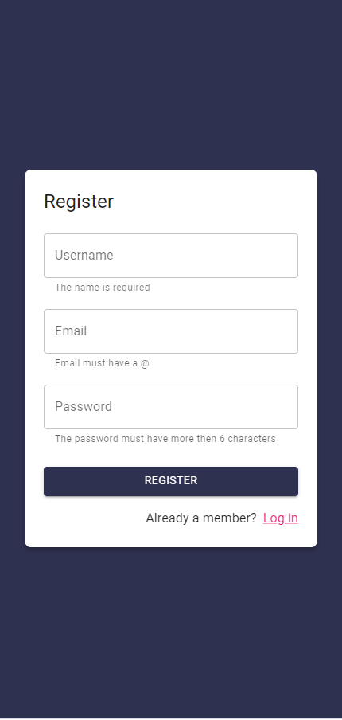

# journal-app

Journal App is a journal application where the users can pen down their notes

[Click here to see the live demo](https://journal-app-ract-redux.netlify.app/)

## Tech Stack

- Vite
- React
- Redux
- TypeScript
- Firebase
- Material UI
- Jest
- Testing Library

## Features

### Creating notes

One of the key features of journal-app is the ability for users to create notes with pictures associated with the notes.

### User authentication

I used the Аirebase to authenticate the user and implemented login and register with Google and user credentials (email, password)

 

## Getting started

To get started using journal-app, you need to install:

- Node.js
- All the needed dependencies using <code>yarn</code> after cloning the repository

### Running the application

To run the application, use the following command:

<code>yarn dev</code>

### Testing

To run the tests, use the following command:

<code>yarn test</code>

